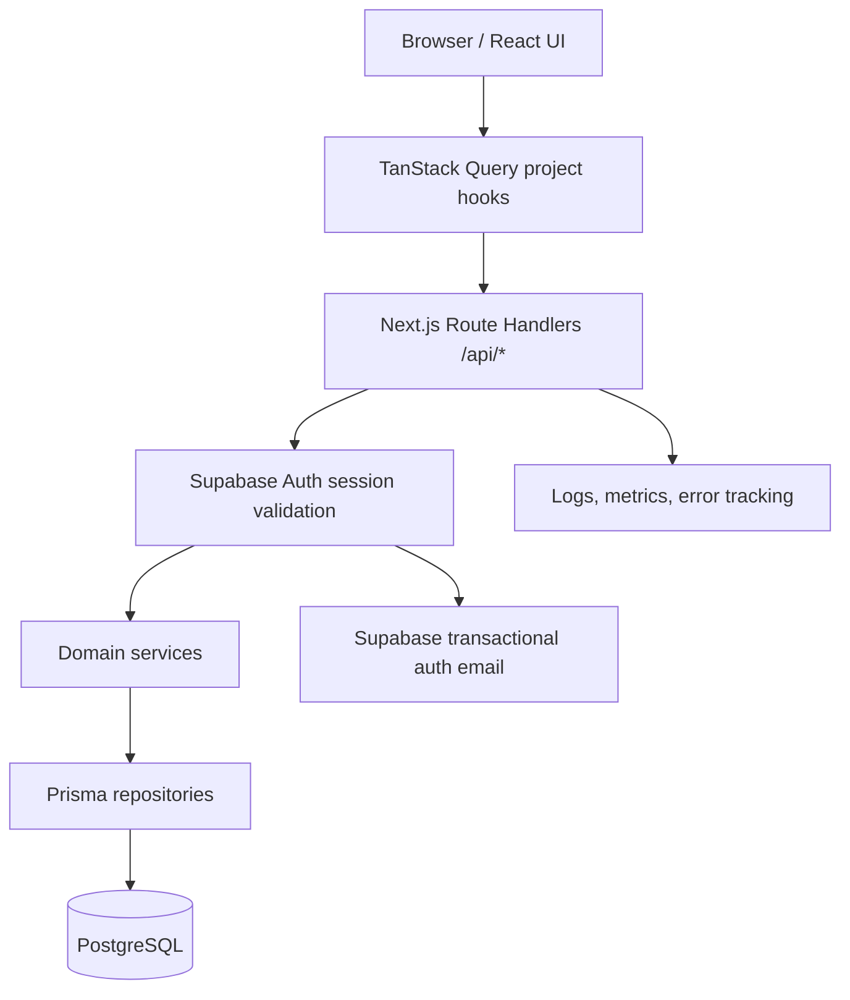

# ProjectForge Production Architecture

This document summarizes the recommended production architecture for the current ProjectForge codebase. The full execution plan is in `PRODUCTION_IMPLEMENTATION_GUIDE.md`; the schema details are in `DATABASE_SCHEMA.md`.

## Current application snapshot

ProjectForge is a Next.js App Router application with client-rendered workspace pages. The landing page, dashboard, auth screens, and project detail screen are implemented under `src/app` and `src/components`. TanStack Query calls a feature repository abstraction that talks to protected internal API routes. Prisma schema and migration files live under `prisma`, while runtime database access is centralized in `src/lib/prisma.ts`.

## Recommended production shape

Keep the existing Next.js monolith and add a backend inside the App Router. This is the simplest production architecture because it preserves the current deployment target (`vercel.json`) and avoids introducing a separate API service before the product needs one.

## Layers

| Layer | Recommended location | Responsibility |
| --- | --- | --- |
| UI routes | `src/app/**/page.tsx` | Page composition, route params, metadata. |
| Client components | `src/components/**` | Rendering, interaction state, loading/empty/error states. |
| Query hooks | `src/features/projects/queries.ts` and future feature query modules | TanStack Query keys, retries, invalidation, optimistic updates when safe. |
| Browser API clients | `src/features/*/*-repository.ts` or `src/features/*/api-client.ts` | Fetch calls to internal APIs; no direct database access. |
| API routes | `src/app/api/**/route.ts` | HTTP boundary, auth middleware calls, request parsing, response mapping. |
| Validators | `src/lib/schemas.ts` and feature-specific schema files | Shared frontend/backend input validation with Zod. |
| Services | `src/server/services/**` | Business rules and orchestration. |
| Repositories | `src/server/repositories/**` | Prisma queries and transactions. |
| Auth | `src/server/auth/**` | Supabase session validation, user provisioning, owner checks. |
| Database | `prisma/schema.prisma`, `prisma/migrations/**` | PostgreSQL schema and migration history. |
| Configuration | `.env.local`, deployment env vars, `.env.example` | Secrets and environment-specific values. |

## Key production principles

1. The backend must be the source of truth for all workspace data.
2. All project resources must be scoped by authenticated `ownerId` until organizations/memberships are added.
3. Demo data can exist only as development/test seed data and must never appear in production by default.
4. All mutations must be validated at the API boundary and constrained at the database layer.
5. Route handlers should return consistent sanitized errors; internal details belong in logs/error tracking.
6. Use PostgreSQL indexes already suggested by the Prisma schema, and add pagination to every list endpoint.
7. Keep external services minimal: Supabase Auth, PostgreSQL, hosting, logging/error tracking, and optional object storage only when file uploads are introduced.
