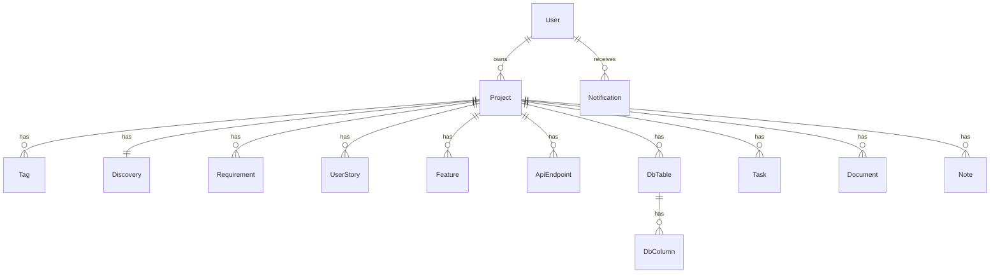

# ProjectForge Production Database Schema

ProjectForge already includes a Prisma schema for PostgreSQL in `prisma/schema.prisma`. This document refines it into an implementation-ready production database design. Table names below use Prisma model names; SQL names can remain quoted PascalCase through Prisma or be mapped to snake_case with `@@map` in a future migration.

## Enumerations

| Enum | Values | Purpose |
| --- | --- | --- |
| `ProjectStatus` | `DISCOVERY`, `PLANNING`, `ACTIVE`, `ARCHIVED`, `COMPLETED` | Lifecycle state for a project. The UI currently has `Architecture` and `Ready`; production must map or update these values. |
| `Priority` | `LOW`, `MEDIUM`, `HIGH`, `URGENT` | Priority for projects, stories, and features. |
| `WorkStatus` | `BACKLOG`, `TODO`, `DOING`, `TESTING`, `DONE` | Kanban/status flow for implementation tasks and planning artifacts. |

## Users

Purpose: store application profile records linked to Supabase Auth users.

| Column | Type | Required | Default | Description |
| --- | --- | --- | --- | --- |
| `id` | UUID/string | Yes | Auth provider UUID or generated UUID | Primary key. Prefer matching Supabase user id. |
| `email` | string | Yes | none | Unique email. |
| `name` | string | No | null | Display name. |
| `createdAt` | timestamp | Yes | now | Account creation time. |
| `updatedAt` | timestamp | Yes | updatedAt | Last profile update time. |

Constraints/indexes: primary key on `id`; unique `email`; index `createdAt`.

## Projects

Purpose: top-level planning workspace owned by a user.

| Column | Type | Required | Default | Description |
| --- | --- | --- | --- | --- |
| `id` | UUID/string | Yes | uuid | Primary key. |
| `ownerId` | UUID/string | Yes | none | FK to `User.id`. |
| `name` | string | Yes | none | Project name, unique per owner. |
| `description` | string | No | null | Project summary. |
| `platform` | string or enum | Yes | none | Web, Mobile, Desktop, API, SaaS; make enum if values remain fixed. |
| `status` | `ProjectStatus` | Yes | `PLANNING` | Project lifecycle state. |
| `priority` | `Priority` | Yes | `MEDIUM` | Project priority. |
| `deadline` | timestamp | No | null | Target date. |
| `favorite` | boolean | Yes | false | User preference. |
| `archivedAt` | timestamp | No | null | Soft deletion/archive marker. |
| `createdAt` | timestamp | Yes | now | Creation time. |
| `updatedAt` | timestamp | Yes | updatedAt | Last update time. |

Constraints/indexes: FK `ownerId -> User.id` cascading delete; unique `(ownerId, name)`; indexes `(ownerId, status, updatedAt)`, `(ownerId, priority)`, and `archivedAt`.

## Tags

Purpose: project labels used for filtering and search.

| Column | Type | Required | Default | Description |
| --- | --- | --- | --- | --- |
| `id` | UUID/string | Yes | uuid | Primary key. |
| `name` | string | Yes | none | Tag label. |
| `projectId` | UUID/string | Yes | none | FK to `Project.id`. |

Constraints/indexes: unique `(projectId, name)`; index `name`; cascade on project delete.

## Discovery

Purpose: one structured product discovery record per project.

| Column | Type | Required | Default | Description |
| --- | --- | --- | --- | --- |
| `id` | UUID/string | Yes | uuid | Primary key. |
| `projectId` | UUID/string | Yes | none | Unique FK to `Project.id`. |
| `problem` | text | No | null | Problem statement. |
| `targetUsers` | text | No | null | Target user description. |
| `painPoints` | text | No | null | User/business pain points. |
| `competitors` | text | No | null | Competitive context. |
| `valueProposition` | text | No | null | Value proposition. |
| `successMetrics` | text | No | null | Product success metrics. |
| `businessGoals` | text | No | null | Business goals. |

Constraints/indexes: unique `projectId`; cascade on project delete. Add `createdAt` and `updatedAt` in the production migration because every editable artifact should track changes.

## Requirements

Purpose: functional/non-functional requirements for a project.

| Column | Type | Required | Default | Description |
| --- | --- | --- | --- | --- |
| `id` | UUID/string | Yes | uuid | Primary key. |
| `projectId` | UUID/string | Yes | none | FK to `Project.id`. |
| `type` | string or enum | Yes | none | Functional, non-functional, business, compliance, etc. |
| `title` | string | Yes | none | Requirement title. |
| `body` | text | No | null | Requirement details. |
| `position` | integer | Yes | 0 | Sort order. |

Constraints/indexes: index `(projectId, position)`; cascade on project delete. Add timestamps.

## UserStories

Purpose: user stories and acceptance criteria.

| Column | Type | Required | Default | Description |
| --- | --- | --- | --- | --- |
| `id` | UUID/string | Yes | uuid | Primary key. |
| `projectId` | UUID/string | Yes | none | FK to `Project.id`. |
| `title` | string | Yes | none | Story title. |
| `description` | text | No | null | Story narrative. |
| `priority` | `Priority` | Yes | `MEDIUM` | Story priority. |
| `acceptanceCriteria` | text | No | null | Acceptance criteria. |
| `status` | `WorkStatus` | Yes | `BACKLOG` | Story workflow state. |

Constraints/indexes: index `(projectId, status, priority)`; cascade on project delete. Add timestamps.

## Features

Purpose: planned features and implementation notes.

| Column | Type | Required | Default | Description |
| --- | --- | --- | --- | --- |
| `id` | UUID/string | Yes | uuid | Primary key. |
| `projectId` | UUID/string | Yes | none | FK to `Project.id`. |
| `title` | string | Yes | none | Feature name. |
| `estimatedTime` | string | No | null | Human estimate. |
| `difficulty` | string | No | null | Difficulty label. |
| `dependencies` | text | No | null | Dependencies/blocked-by notes. |
| `status` | `WorkStatus` | Yes | `BACKLOG` | Feature workflow state. |
| `priority` | `Priority` | Yes | `MEDIUM` | Feature priority. |

Constraints/indexes: index `(projectId, status, priority)`; cascade on project delete. Add timestamps.

## DbTables

Purpose: database tables designed inside a project plan.

| Column | Type | Required | Default | Description |
| --- | --- | --- | --- | --- |
| `id` | UUID/string | Yes | uuid | Primary key. |
| `projectId` | UUID/string | Yes | none | FK to `Project.id`. |
| `name` | string | Yes | none | Planned table name. |

Constraints/indexes: unique `(projectId, name)`; cascade on project delete. Add timestamps.

## DbColumns

Purpose: columns inside planned project database tables.

| Column | Type | Required | Default | Description |
| --- | --- | --- | --- | --- |
| `id` | UUID/string | Yes | uuid | Primary key. |
| `tableId` | UUID/string | Yes | none | FK to `DbTable.id`. |
| `name` | string | Yes | none | Planned column name. |
| `type` | string | Yes | none | Planned data type. |
| `primaryKey` | boolean | Yes | false | Whether this is a primary key. |
| `foreignKey` | string | No | null | Referenced table/column text or normalized FK metadata in a future enhancement. |
| `nullable` | boolean | Yes | false | Whether null is allowed. |

Constraints/indexes: unique `(tableId, name)`; cascade on table delete. Add timestamps.

## ApiEndpoints

Purpose: API contracts planned for the project.

| Column | Type | Required | Default | Description |
| --- | --- | --- | --- | --- |
| `id` | UUID/string | Yes | uuid | Primary key. |
| `projectId` | UUID/string | Yes | none | FK to `Project.id`. |
| `method` | string or enum | Yes | none | HTTP method. Recommend enum `GET`, `POST`, `PUT`, `PATCH`, `DELETE`. |
| `route` | string | Yes | none | API path. |
| `description` | text | No | null | Endpoint description. |
| `authRequired` | boolean | Yes | true | Whether endpoint requires authentication. |
| `headers` | json | No | null | Header contract. |
| `request` | json | No | null | Request body/query schema. |
| `response` | json | No | null | Response schema/example. |
| `validation` | json | No | null | Validation rules. |
| `statusCodes` | json | No | null | Expected status codes. |
| `example` | json | No | null | Example request/response. |

Constraints/indexes: unique `(projectId, method, route)`; index `(projectId, authRequired)`; cascade on project delete. Add timestamps.

## Tasks

Purpose: implementation/planning task board items.

| Column | Type | Required | Default | Description |
| --- | --- | --- | --- | --- |
| `id` | UUID/string | Yes | uuid | Primary key. |
| `projectId` | UUID/string | Yes | none | FK to `Project.id`. |
| `title` | string | Yes | none | Task title. |
| `status` | `WorkStatus` | Yes | `BACKLOG` | Board column. |
| `position` | integer | Yes | 0 | Sort order within status. |

Constraints/indexes: index `(projectId, status, position)`; cascade on project delete. Add timestamps, optional `description`, optional `assigneeId` later if collaboration is added.

## Documents

Purpose: markdown documents such as README, SRS, release notes.

| Column | Type | Required | Default | Description |
| --- | --- | --- | --- | --- |
| `id` | UUID/string | Yes | uuid | Primary key. |
| `projectId` | UUID/string | Yes | none | FK to `Project.id`. |
| `title` | string | Yes | none | Document title. |
| `markdown` | text | Yes | empty string | Markdown body. |

Constraints/indexes: unique `(projectId, title)`; cascade on project delete. Add timestamps.

## Notes

Purpose: freeform project notes.

| Column | Type | Required | Default | Description |
| --- | --- | --- | --- | --- |
| `id` | UUID/string | Yes | uuid | Primary key. |
| `projectId` | UUID/string | Yes | none | FK to `Project.id`. |
| `markdown` | text | Yes | none | Note content. |

Constraints/indexes: index `projectId`; cascade on project delete. Add timestamps.

## Notifications

Purpose: in-app notifications for project/activity events.

| Column | Type | Required | Default | Description |
| --- | --- | --- | --- | --- |
| `id` | UUID/string | Yes | uuid | Primary key. |
| `userId` | UUID/string | Yes | none | FK to `User.id`. |
| `title` | string | Yes | none | Notification text. |
| `read` | boolean | Yes | false | Read flag. |
| `createdAt` | timestamp | Yes | now | Creation time. |

Constraints/indexes: index `(userId, read, createdAt)`; cascade on user delete. Add optional `projectId`, `type`, and `metadata` only when notification types need deep links or structured payloads.

## Recommended ERD

## Required schema improvements before production

1. Add `createdAt` and `updatedAt` to every editable child entity.
2. Decide whether UI status `Architecture` should become `ACTIVE`, whether UI `Ready` should become `COMPLETED`, or whether the Prisma enum should be expanded.
3. Convert `platform`, `Requirement.type`, and `ApiEndpoint.method` to enums if the app will enforce fixed options.
4. Add `deletedAt`/soft archive only to entities that need restore behavior. `Project.archivedAt` is already present.
5. Create a fresh baseline migration if the existing SQL migration is incomplete for a new database, or generate a full initial migration from Prisma before production.
